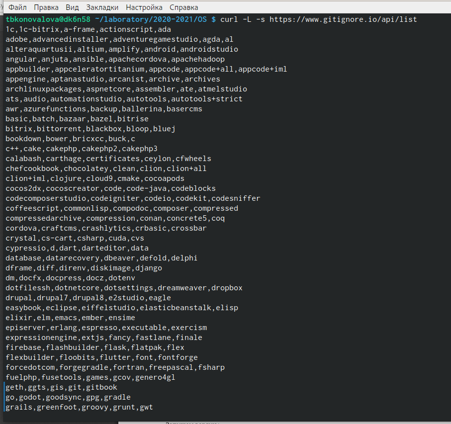

---
## Front matter
title: "РОССИЙСКИЙ УНИВЕРСИТЕТ ДРУЖБЫ НАРОДОВ
 Факультет физико-математических и естественных наук
Кафедра прикладной информатики и теории вероятностей"
subtitle: "ОТЧЕТ"
по лабораторной работе № 2"
author: "Кочуров Арсений Владимирович"

## Generic otions
lang: ru-RU
toc-title: "Содержание"

## Bibliography
bibliography: bib/cite.bib
csl: pandoc/csl/gost-r-7-0-5-2008-numeric.csl

## Pdf output format
toc: true # Table of contents
toc-depth: 2
lof: true # List of figures
lot: true # List of tables
fontsize: 12pt
linestretch: 1.5
papersize: a4
documentclass: scrreprt
## I18n polyglossia
polyglossia-lang:
  name: russian
  options:
	- spelling=modern
	- babelshorthands=true
polyglossia-otherlangs:
  name: english
## I18n babel
babel-lang: russian
babel-otherlangs: english
## Fonts
mainfont: PT Serif
romanfont: PT Serif
sansfont: PT Sans
monofont: PT Mono
mainfontoptions: Ligatures=TeX
romanfontoptions: Ligatures=TeX
sansfontoptions: Ligatures=TeX,Scale=MatchLowercase
monofontoptions: Scale=MatchLowercase,Scale=0.9
## Biblatex
biblatex: true
biblio-style: "gost-numeric"
biblatexoptions:
  - parentracker=true
  - backend=biber
  - hyperref=auto
  - language=auto
  - autolang=other*
  - citestyle=gost-numeric
## Pandoc-crossref LaTeX customization
figureTitle: "Рис."
tableTitle: "Таблица"
listingTitle: "Листинг"
lofTitle: "Список иллюстраций"
lotTitle: "Список таблиц"
lolTitle: "Листинги"
## Misc options
indent: true
header-includes:
  - \usepackage{indentfirst}
  - \usepackage{float} # keep figures where there are in the text
  - \floatplacement{figure}{H} # keep figures where there are in the text
---

# Цель работы

- Изучить идеологию и применение средств контроля версий.
– Освоить умения по работе с git.

# Задание

изучить идеологию и применение средств контроля версий

# Теоретическое введение

##Наиболее часто используемые команды git:
– создание основного дерева репозитория: git init
– получение обновлений (изменений) текущего дерева из центрального репозитория: git pull
– отправка всех произведённых изменений локального дерева в центральный репозиторий: git push
– просмотр списка изменённых файлов в текущей директории: git status
– просмотр текущих изменения: git diff
– добавить все изменённые и/или созданные файлы и/или каталоги: git add .
– добавить конкретн ые изменённые и/или созданные файлы и/или каталоги: git add имена_файлов
– удалить файл и/или каталог из индекса репозитория (при этом файл и/или каталог
остаётся в локальной директории): git rm имена_файлов
– сохранить все добавленные изменения и все изменённые файлы: git commit -am 'Описание коммита'
– сохранить добавленные изменения с внесением комментария через встроенный: git commit
– создание новой ветки, базирующейся на текущей: git checkout -b имя_ветки
– переключение на некоторую ветку: git checkout имя_ветки
– отправка изменений конкретной ветки в центральный репозиторий: git push origin имя_ветки
– слияние ветки с текущим деревом: git merge --no-ff имя_ветки
– удаление локальной уже слитой с основным деревом ветки: git branch -d имя_ветки
– принудительное удаление локальной ветки: git branch -D имя_ветки
– удаление ветки с центрального репозитория: git push origin :имя_ветки

# Выполнение лабораторной работы
1) Создаём учётную запись на https://github.com.
{ #fig:001 width=70% }
2) Настраиваем систему контроля версий git. Синхронизируем учётную запись github с компьютером:
git config --global user.name"Имя Фамилия"
git config --global user.email"work@mail"
{ #fig:001 width=70% }
После этого создаём новый ключ на github (команда ssh-keygen -C"Avkochurov <superarsenchik@gmail.com>") и привязываем его к компьютеру через консоль.
3) Следующим шагом будет создание и подключение репозитория к github. В gethub заходим в «repository» и создаём новый репозиторий (имя «laboratory», а заголовок для файла README). Копируем в консоль ссылку на репозиторий (для дальнейшей работы с файлами):
{ #fig:001 width=70% }
{ #fig:001 width=70% }
{ #fig:001 width=70% }
4) В лабораторной работе описан логаритм создания структуры каталога через консоль. Но легче будет создать репозиторий в gethub и после этого работать с каталогом и папками через консоль (перед этим необходимо скопировать ссылку на репозиторий в консоль, в формате https или ssh).
Перед тем, как создавать файлы, заходим в наш репозиторий:
{ #fig:001 width=70% }
После этого можем уже создавать наши файлы:
{ #fig:001 width=70% }
5) Добавляем первый коммит и выкладываем на gethub. Для того, чтобы правильно разместить первый коммит, необходимо добавить команду git add ., после этого с помощью команды git commit -am "first commit" выкладываем коммит:
{ #fig:001 width=70% }
6) Сохраняем первый коммит, используя команду git push:
{ #fig:001 width=70% }
7) Первичная конфигурация:
1. Добавляем файл лицензии;
{ #fig:001 width=70% }
2. Добавим шаблон игнорируемых файлов. Просмотрим список имеющихся шаблонов (на скриншоте список шаблонов представлен не в целом виде):
{ #fig:001 width=70% }
3. Скачиваем шаблон, например, для C. Также добавляем новые файлы и выполняем коммит:
{ #fig:001 width=70% }
4. Отправим на github (для этого сохраним все созданные шаблоны и файлы, используя команду git push):
{ #fig:001 width=70% }
8) Работаем с конфигурацией git-flow
1. Инициализируем git-flow, используя команду git flow init -f (префикс для ярлыков установлен в v):
{ #fig:001 width=70% }
2. Проверяем, что мы находимся на ветке develop (используем команду git branch):
{ #fig:001 width=70% }
3. Создаём релиз с версией 1.0.0:
{ #fig:001 width=70% }
4. Запишем версию и добавим в индекс:
echo'hello world'> hello.txt
git add hello.txt
git commit -am'Новый файл
{ #fig:001 width=70% }
5. Заливаем релизную ветку в основную ветку (используем команду git flow release finish1.0.0):
{ #fig:001 width=70% }
6. Отправляем данные на github:
{ #fig:001 width=70% }
git push - -all
git push - -tags
9). Создаем релиз на github. Для этого заходим в «Releases», нажимаем «Создать новый релиз». Заходим в теги и заполняем все поля (создаём теги для версии 1.0.0). После создания тега, автоматически сформируется релиз.
{ #fig:001 width=70% }
{ #fig:001 width=70% }
# Выводы

Изучил идеологию и научилась пременять средства контроля версий.

# Список литературы{.unnumbered}

::: {#refs}
:::
