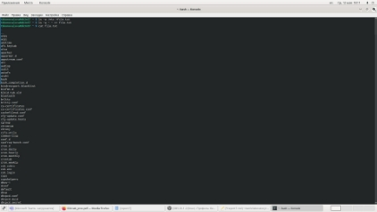
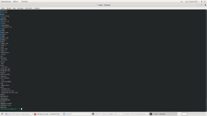



**Лабораторная работа №7**
### **Дисциплина: Операционные системы**

## Кочуров Арсений Владимирович

**Содержание**

1. [Цель работы](#_bookmark0)	5**
1. [**Задание](#_bookmark1)	**6**
1. [**Выполнение лабораторной работы](#_bookmark2)	**7**
1. [**Выводы](#_bookmark26)	**23**

29

**List of Tables**

**List of Figures**

[3.1	Запись файлов](#_bookmark3)  .  .  .  .  .  .  .  .  .  .  .  .  .  .  .  .  .  .  .  .  .  .  .  .  .  .  .  .	7

[3.2	Файлы в файле file.txt](#_bookmark4)  .  .  .  .  .  .  .  .  .  .  .  .  .  .  .  .  .  .  .  .  .  .  .  .	8

[3.3	Вывожу имена файлов](#_bookmark5) .  .  .  .  .  .  .  .  .  .  .  .  .  .  .  .  .  .  .  .  .  .  .  .	8

[3.4	Файлы с расширением .conf](#_bookmark6)  .  .  .  .  .  .  .  .  .  .  .  .  .  .  .  .  .  .  .  .  .	9

[3.5	Создание файлов ](#_bookmark7).  .  .  .  .  .  .  .  .  .  .  .  .  .  .  .  .  .  .  .  .  .  .  .  .  .  .	9

[3.6	команда «find /etc –maxdepth1 –name “h ” | less»](#_bookmark8)  .  .  .  .  .  .  .  .  .  .      9 [3.7	список файлов](#_bookmark9)	10

8. [Фоновый режим процесса](#_bookmark10)	11
8. [Фоновый режим процесса](#_bookmark11)	11
8. [Удаление файла](#_bookmark12)	12
8. [Удаление файла с помощью команды rm](#_bookmark13)	12
8. [Редактор gedit](#_bookmark14)	12
8. [команда «ps| grep-i“gedit”»](#_bookmark15)	13
8. [команда kill](#_bookmark16)	13
8. [информация по команде kill](#_bookmark17)	13
8. [завершение процесса gedit](#_bookmark18)	14
8. [команды df, du](#_bookmark19)	15
8. [информация команды df](#_bookmark20)	15
8. [информация команды du](#_bookmark21)	16
8. [команда df в консоли](#_bookmark22)	16
8. [команда du в консоли](#_bookmark23)	17
8. [Информация конмады find](#_bookmark24)	17
8. [имена всех директорий](#_bookmark25)	18

1. # **Цель работы**

Цель данной лабораторной работы — Ознакомление с инструментами поиска файлов и фильтрации текстовых данных. Приобретение практических навыков: по управлению процессами (и задания-ми), по проверке использования диска и обслуживанию файловых систем.

1. # **Задание**

1. Сделать отчёт по лабораторной работе №7 в формате Markdown.
1. Ознакомление с инструментами поиска файлов и фильтрации текстовых данных.

1. # **Выполнение лабораторной работы**

1. Осуществил вход в систему, используя соответствующее имя пользователя.

2). Записал в файл file.txt название файлов, содержащийся в определённом каталоге. Для того, чтобы записать в файл file.txt названия файлов, содержащихся в каталоге /etc, использовал команду «ls–a/etc> file.txt». Далее с помощью коман- ды «ls-a~ » file.txt» дописываю в этот же файл названия файлов, содержащихся в домашнем каталоге. Командой «catfile.txt» просматриваю файл, чтобы убедиться

в правильности действий (алгоритм действий представлен на рис. [3.1 ](#_bookmark3), [3.2).](#_bookmark4)

Figure 3.1: Запись файлов

Figure 3.2: Файлы в файле file.txt

3. Вывел имена всех файлов из file.txt, имеющих расширение .conf и записал их в новый текстовой файл conf.txt, используя команду «grep-e‘.conf$’file.txt> conf.txt». С помощью команды «catconf.txt» проверяю правильность выполнен- ных действий (иллюстрация на рис. [3.3 ](#_bookmark5), [3.4).](#_bookmark6)

Figure 3.3: Вывожу имена файлов

Figure 3.4: Файлы с расширением .conf

3. Определить, какие файлы в домашнем каталоге имеют имена, начинающи- еся с символа c, можно несколькими командами: - «find~ -maxdepth1 -name“c*”*

*-print» (опция maxdepth1 необходима для того, чтобы файлы находились строго только в домашнем каталоге); - «ls~/c*»; - «ls–a~ | grepc » (см. рис. [3.5).](#_bookmark7)

Figure 3.5: Создание файлов

3. Чтобы вывести на экран (постранично) имена файлов из каталога /etc, начинающиеся с символа h, я использовала команду «find /etc –maxdepth1 –name “h ”

| less» (Скриншоты [3.6 ](#_bookmark8), [3.7).](#_bookmark9)

Figure 3.6: команда «find /etc –maxdepth1 –name “h ” | less»

Figure 3.7: список файлов

3. Запускаю в фоновом режиме процесс, который будет записывать в файл

~/logfile файлы, имена которых начинаются с log, используя команду «find/ - name“log ” > logfile&» (Скриншоты [3.8 ](#_bookmark10), [3.9). ](#_bookmark11)Так как в фоновом режиме у меня запустился беспрерывный процесс записывания файла, я сделал скриншоты некоторых частей работы процесса. Командой «catlogfile» проверяю выполнен- ные действия (Рисунок [3.10). ](#_bookmark12)Далее удалила файл ~/logfile с помощью команды

«rm logfile», у меня данный файл уже был удалён, поэтому программа вывела

сообщение об этом (Рисунок [3.11).](#_bookmark13)

Figure 3.8: Фоновый режим процесса

Figure 3.9: Фоновый режим процесса

Figure 3.10: Удаление файла

Figure 3.11: Удаление файла с помощью команды rm

3. Смотрите пункт 6.
3. Запускаю редактор gedit в фоновом режиме командой «gedit&» (Рисунок [3.12). ](#_bookmark14)После этого на экране появляется окно редактора.

Figure 3.12: Редактор gedit

3. Чтобы определить идентификатор процесса gedit, использую команду «ps| grep-i“gedit”» (Скриншот [3.13). ](#_bookmark15)Из рисунка видно, что наш процесс имеет PID 24249. Узнать идентификатор процесса можно также, используя команду «pgrep gedit»или «pidof gedit».

Figure 3.13: команда «ps| grep-i“gedit”»

3. Прочитав информацию о команде kill с помощью команды «man kill», использую её для завершения процесса gedit (команда «kill 24249») (Алгоритм действий представлен на рис. [3.14 ](#_bookmark16), [3.15 ](#_bookmark17), [3.16).](#_bookmark18)

Figure 3.14: команда kill

Figure 3.15: информация по команде kill

Figure 3.16: завершение процесса gedit

3. C помощью команд «mandf» и «mandu» узнаю информацию по необходи- мым командам и далее использую их (Рисунки [3.17 ](#_bookmark19), [3.18 ](#_bookmark20), [3.19 ](#_bookmark21), [3.20 ](#_bookmark22), [3.21). ](#_bookmark23)df

– утилита, показывающая список всех файловых систем по именам устройств, сообщает их размер, занятое и свободное пространство и точки монтирования. Синтаксис: df[опции] устройств. du – утилита, предназначенная для вывода ин- формации об объеме дискового пространства, занятого файлами и директориями. Она принимает путь к элементу файловой системы и выводит информацию о количестве байт дискового пространства или блоков диска, задействованных для его хранения. Синтаксис: du [опции] каталог\_или\_файл

Figure 3.17: команды df, du

Figure 3.18: информация команды df

Figure 3.19: информация команды du

Figure 3.20: команда df в консоли

Figure 3.21: команда du в консоли

3. Вывел имена всех директорий, имеющихся в моем домашнем каталоге с помощью команды «find~ -typed», предварительно получив информацию с помощью команды «man find» (Скриншоты [3.22 ](#_bookmark24), [3.23).](#_bookmark25)

Figure 3.22: Информация конмады find

Figure 3.23: имена всех директорий

Ответы на контрольные вопросы:

1. В системе по умолчанию открыто три специальных потока:

–stdin − стандартный поток ввода (по умолчанию: клавиатура), файловый дескриптор 0;

–stdout − стандартный поток вывода (по умолчанию: консоль), файловый де- скриптор 1;

-stderr − стандартный поток вывод сообщений об ошибках (поумолчанию: консоль), файловый дескриптор 2.

Большинство используемых в консоли команд и программ записывают резуль- таты своей работы в стандартный поток вывода stdout.

1. ‘>’ Перенаправление вывода в файл

‘»’ Перенаправление вывода в файл и открытие файла в режиме добавления (данные добавляются в конец файла)/

1. Конвейер (pipe) служит для объединения простых команд или утилит в цепочки, в которых результат работы предыдущей команды передаётся последу- ющей.

Синтаксис следующий:

команда1|команда2 (это означает, что вывод команды 1 передастся на ввод команде 2)

1. Процесс рассматривается операционной системой как заявка на потребле- ние всех видов ресурсов, кроме одного − процессорного времени. Этот последний важнейший ресурс распределяется операционной системой между другими еди- ницами работы − потоками, которые и получили свое название благодаря тому, что они представляют собой последовательности (потоки выполнения) команд.

Процесс − это выполнение программы. Он считается активной сущностью и реализует действия, указанные в программе.

Программа представляет собой статический набор команд, а процесс это набор ресурсов и данных, использующихся при выполнении программы.

1. pid: идентификатор процесса (PID) процесса (processID), к которому вызы- вают метод

gid: идентификатор группы UNIX, в котором работает программа.

1. Любую выполняющуюся в консоли команду или внешнюю программу можно запустить в фоновом режиме. Для этого следует в конце имени команды указать знак амперсанда &.

Запущенные фоном программы называются задачами (jobs). Ими можно управ- лять с помощью команды jobs, которая выводит список запущенных в данный момент задач.

1. top − это консольная программа, которая показывает список работающих процессов в системе. Программа в реальном времени отсортирует запущенные процессы по их нагрузке на процессор.

htop − это продвинутый консольный мониторинг процессов. Утилита выводит постоянно меняющийся список системных процессов, который сортируется в зависимости от нагрузки на ЦПУ. Если делать сравнение сtop, то htop показыва- ет абсолютно все процессы в системе, время их непрерывного использования, загрузку процессоров и расход оперативной памяти.

1. find − это команда для поиска файлов и каталогов на основе специальных условий. Ее можно использовать в различных обстоятельствах, например, для поиска файлов по разрешениям, владельцам, группам, типу, размеру и другим подобным критериям.

Команда find имеет такой синтаксис: find[папка][параметры] критерий шаблон [действие] Папка − каталог в котором будем искать

Параметры − дополнительные параметры, например, глубина поиска, и т д. Критерий − по какому критерию будем искать: имя, дата создания, права,

владелец и т д.

Шаблон – непосредственно значение по которому будем отбирать файлы. Основные параметры:

-P никогда не открывать символические ссылки

-L - получает информацию о файлах по символическим ссылкам. Важно для дальнейшей обработки, чтобы обрабатывалась не ссылка, а сам файл.

-maxdepth - максимальная глубина поиска по подкаталогам,для поиска только в текущем каталоге установите 1.

-depth - искать сначала в текущем каталоге, а потом в подкаталогах

-mount искать файлы только в этой файловой системе.

-version - показать версию утилиты find

-print - выводить полные имена файлов

-typef - искать только файлы

-typed - поиск папки в Linux Основные критерии:

-name - поиск файлов по имени

-perm - поиск файлов в Linux по режиму доступа

-user - поиск файлов по владельцу

-group - поиск по группе

-mtime - поиск по времени модификации файла

-atime - поиск файлов по дате последнего чтения

-nogroup - поиск файлов, не принадлежащих ни одной группе

-nouser - поиск файлов без владельцев

-newer - найти файлы новее чем указанный

-size - поиск файлов в Linux по их размеру Примеры:

find~ -type d поиск директорий в домашнем каталоге

find~ -type f -name ”. ” поиск скрытых файлов в домашнем каталоге

1. Файл по его содержимому можно найти с помощью команды grep: «grep -r” слово/выражение, которое нужно найти”».
1. Утилита df, позволяет проанализировать свободное пространство на всех подключенных к системе разделах.
1. При выполнении команды du (без указания папки и опции) можно полу- чить все файлы и папки текущей директории с их размерами. Для домашнего каталога: du ~/
1. Основные сигналы (каждый сигнал имеет свой номер), которые использу- ются для завершения процесса:

0. SIGINT–самый безобидный сигнал завершения, означает Interrupt. Он от- правляется процессу, запущенному из терминала с помощью сочетания клавиш Ctrl+C. Процесс правильно завершает все свои действия и возвра- щает управление;
0. SIGQUIT–это еще один сигнал, который отправляется с помощью сочетания клавиш, программе, запущенной в терминале. Он сообщает ей что нужно завершиться и программа может выполнить корректное завершение или проигнорировать сигнал. В отличие от предыдущего, она генерирует дамп памяти. Сочетание клавиш Ctrl+/;
0. SIGHUP–сообщает процессу, что соединение с управляющим терминалом разорвано, отправляется, в основном, системой при разрыве соединения с

интернетом;

0. SIGTERM–немедленно завершает процесс, но обрабатывается программой, поэтому позволяет ей завершить дочерние процессы и освободить все ре- сурсы;
0. SIGKILL–тоже немедленно завершает процесс, но, в отличие от предыдуще- го варианта, он не передается самому процессу, а обрабатывается ядром. Поэтому ресурсы и дочерние процессы остаются запущенными.

Также для передачи сигналов процессам в Linux используется утилита kill, её синтаксис: kill [-сигнал] [pid\_процесса] (PID – уникальный идентификатор процесса). Сигнал представляет собой один из выше перечисленных сигналов для завершения процесса.

Перед тем, как выполнить остановку процесса, нужно определить его PID. Для этого используют команды ps и grep. Команда ps предназначена для вывода спис- ка активных процессов в системе и информации о них. Команда grep запускается одновременно с ps (вканале) и будет выполнять поиск по результатам команды ps.

Утилита pkill – это оболочка для kill, она ведет себя точно так же, и имеет тот же синтаксис, только в качестве идентификатора процесса ей нужно передать ег оимя.

killall работает аналогично двум предыдущим утилитам. Она тоже принимает имя процесса в качестве параметра и ищет его PID в директории /proc. Но эта утилита обнаружит все процессы с таким именем и завершит их.

1. # **Выводы**

В ходе выполнения данной лабораторной работы я изучила инструменты поиска файлови фильтрации текстовых данных, а также приобрела практические навы- ки: по управлению процессами (и заданиями), по проверке использования диска и обслуживанию файловых систем.
